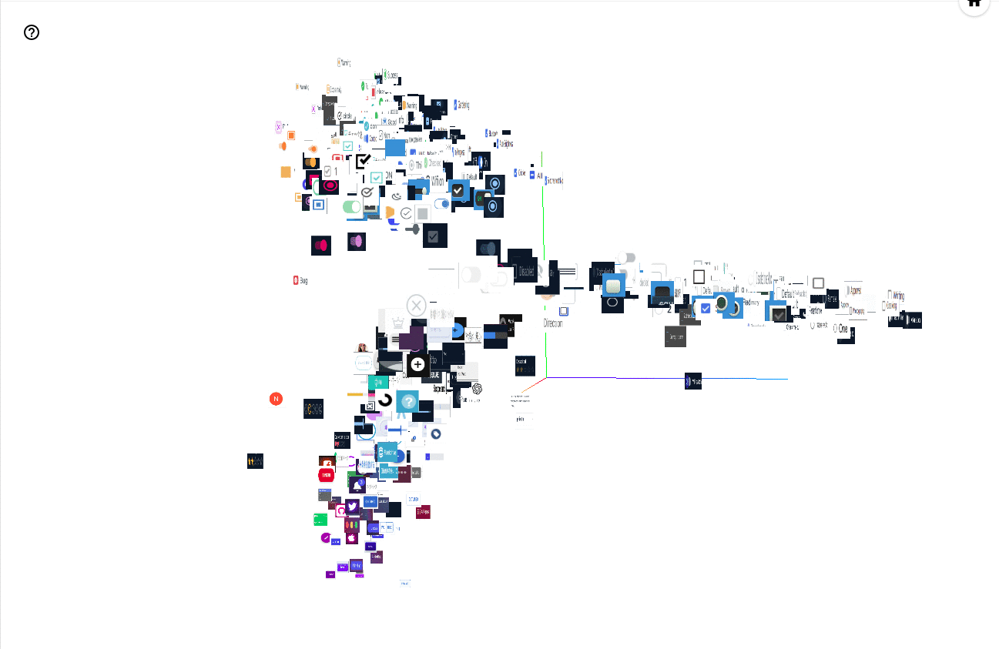
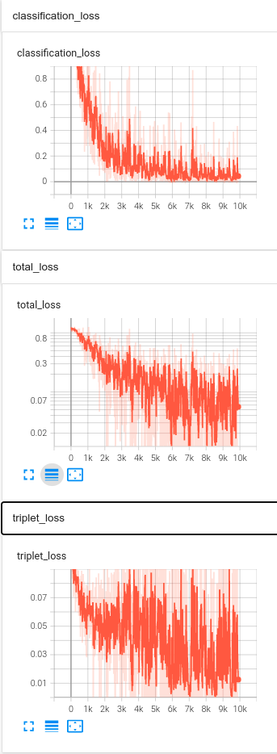
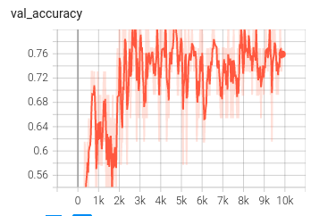
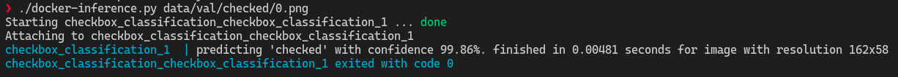

# Checkbox classification

This repository contains the testing project for classifying whether an image is a (1) **checked**-checkbox, (2) **unchecked**-checkbox, or (3) **others**.

The project is implemented with [PyTorch](https://pytorch.org) framework with [Tensorboard](https://www.tensorflow.org/tensorboard) to keep track of the losses, accuracy, and embeddings

In order to have a classifier that generalizes even to unforeseen data, this repository combines [Triplet Loss](http://www.bmva.org/bmvc/2016/papers/paper119/index.html) with Classification loss. In the picture below, you can see the feature embeddings visualized in Tensorflow. The features for each clusters (1)checked, (2)unchecked, and (3)others are distinctly separated. With bigger number of dataset, this would definitely improve the classification of the checkbox.



# Installation
```
pip install albumentations
mamba install -y pytorch torchvision torchaudio cudatoolkit=10.2 pytorch-metric-learning tensorboard -c metric-learning -c pytorch
```

# Training
To run the training, you would need to provide the configuration to train, for example [config/default.yaml](config/default.yaml). You can run using the command below
```
python main_train.py config/default.yaml
```

If you're lazy to install dependencies, you can also run the following for inference
```
./docker-train.py [--cfg default.yaml]
```

The image below shows the comparison of the classification loss, triplet loss, and total loss for reference of the impact of multi-task loss.


The image below shows the validation accuracy over the time


# Inference
To run single image inference, you can use the following command
```
python main_inference.py /path/to/image.jpg
```

If you're lazy to install dependencies, you can also run the following for inference
```
./docker-inference.py /path/to/image.jpg
```
for example, by running `./docker-inference.py data/val/checked/0.png`, you would be getting result similar to the image below


*NOTE: The docker image used this repo can be found in https://hub.docker.com/repository/docker/ardiya/checkbox_classification*


# Citation
```
@inproceedings{BMVC2016_119,
    title={Learning local feature descriptors with triplets and shallow convolutional neural networks},
    author={Vassileios Balntas, Edgar Riba, Daniel Ponsa and Krystian  Mikolajczyk},
    year={2016},
    month={September},
    pages={119.1-119.11},
    articleno={119},
    numpages={11},
    booktitle={Proceedings of the British Machine Vision Conference (BMVC)},
    publisher={BMVA Press},
    editor={Richard C. Wilson, Edwin R. Hancock and William A. P. Smith},
    doi={10.5244/C.30.119},
    isbn={1-901725-59-6},
    url={https://dx.doi.org/10.5244/C.30.119}
}
```